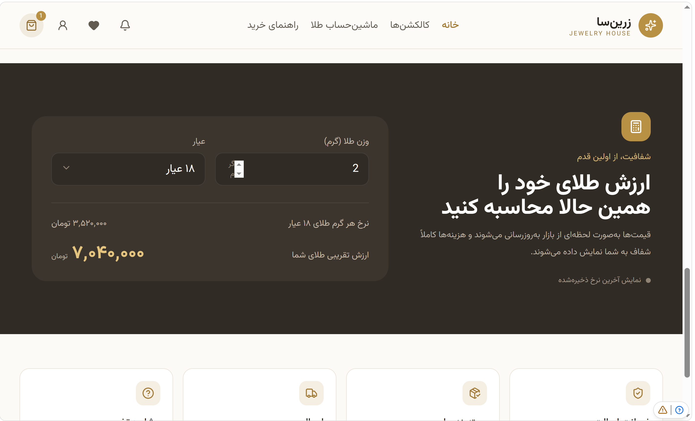
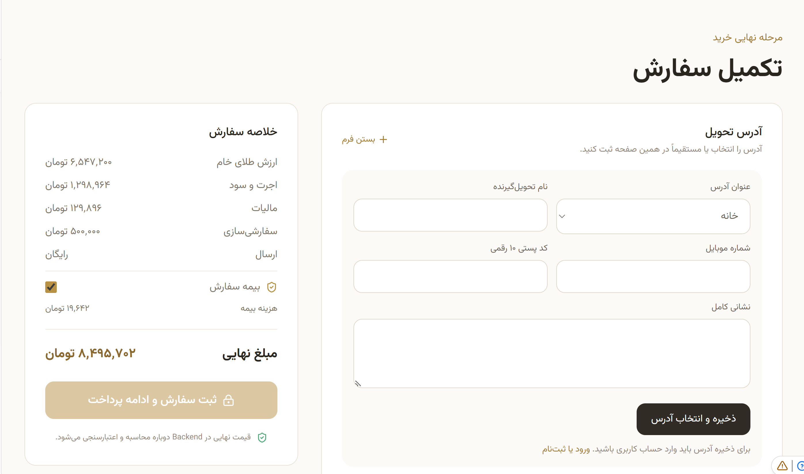

# Zarrin Jewelry

A full-stack web app for selling gold and jewelry online. Customers can browse the collection, see prices based on the current gold price, save favorites, place orders, and track them. The store owner gets a protected admin area, order and notification management, and a production-minded setup with database migrations, backups, and recovery tooling.

## Screenshots

### Home


### Collection


### Price calculator



### Cart


### Order



## Features

**For customers**
- **Product catalog** — browse the jewelry collection and view product details
- **Gold-price-based pricing** — a gold price service and hook keep product prices in sync with the market
- **Cart and wishlist** — save items to buy now or later
- **Checkout and invoices** — place orders and view printable invoices
- **Order tracking** — follow an order from placement to delivery, with order detail pages
- **Notifications** — in-app notifications about orders and account activity
- **Certificate verification** — check the authenticity of a jewelry certificate
- **Size guide** — help choosing the right ring or bracelet size
- **Accounts** — register, log in, and view your account orders

**For the store owner**
- **Admin panel** — protected area for managing products, orders, and customers
- **Admin access control** — separate admin credentials and access management
- **Order reservations** — stock is reserved while an order is in progress
- **Notification delivery** — a dedicated service for sending notifications

**Security and operations**
- Request validation with Zod
- Rate limiting and security middleware
- Observability middleware for request monitoring
- Versioned SQL migrations
- Backup, verification, restore, and recovery-drill scripts

## Tech Stack

**Frontend**
- React 18 + TypeScript, built with Vite
- React Router and TanStack Query
- Tailwind CSS and shadcn/ui (Radix UI)
- Framer Motion for animations
- Three.js with React Three Fiber for 3D content

**Backend**
- Node.js + Express 5 + TypeScript
- PostgreSQL (`pg`) with plain SQL migrations
- Zod validation

**Tooling and deployment**
- pnpm
- Vitest for unit tests
- Prettier and TypeScript type checking
- Netlify (static client + serverless API via `serverless-http`)

## Project Structure

```
zarrin-jewelry
├─ client/                  # React app
│  ├─ components/           # AdminAccessPanel, ui/ (shadcn/ui)
│  ├─ hooks/                # use-gold-price, use-mobile, use-toast
│  ├─ lib/                  # cart, wishlist, utils
│  └─ pages/                # Index, ProductDetail, Cart, Checkout, Invoice,
│                           # OrderDetail, TrackOrder, Wishlist, Notifications,
│                           # VerifyCertificate, SizeGuide, Auth, Admin
├─ server/                  # Express API
│  ├─ controllers/          # admin, auth, gold-price, orders, products
│  ├─ middlewares/          # observability, rate-limit, security
│  ├─ repositories/         # Database access (account, admin, notifications,
│  │                        # orders, products, users)
│  ├─ routes/               # API routes
│  ├─ services/             # auth-session, gold-price, notification-delivery
│  ├─ validators/           # Zod schemas (admin, auth, orders)
│  ├─ db.ts                 # PostgreSQL connection
│  └─ env.ts                # Environment configuration
├─ shared/                  # Code shared by client and server (gold, products)
├─ database/migrations/     # Versioned SQL migrations (001 to 006)
├─ scripts/                 # Migration, backup, recovery, and test scripts
├─ docs/screenshot/         # App screenshots
├─ netlify/functions/       # Serverless API entry for Netlify
└─ netlify.toml
```

## Getting Started

### Prerequisites

- Node.js 18+
- pnpm
- A PostgreSQL database

### Installation

```bash
git clone https://github.com/<your-username>/zarrin-jewelry.git
cd zarrin-jewelry
pnpm install
```

### Environment variables

Create a `.env` file in the project root and set the values the server needs (see `server/env.ts` for the full list):

```env
DATABASE_URL=your_postgres_connection_string
PORT=3000
```

### Run the database migrations

```bash
pnpm db:migrate
```

### Run in development

```bash
pnpm dev
```

### Build and run in production

```bash
pnpm build
pnpm start
```

## Scripts

| Command | Description |
| --- | --- |
| `pnpm test` | Run unit tests with Vitest |
| `pnpm typecheck` | Run the TypeScript compiler |
| `pnpm format.fix` | Format the codebase with Prettier |
| `pnpm test:order-flow` | Run the end-to-end order flow check |
| `pnpm test:security` | Run the security checks |

## Backup and Recovery

The project ships with scripts for protecting production data:

| Command | Description |
| --- | --- |
| `pnpm db:backup` | Create a database backup |
| `pnpm db:backup-job` | Run the scheduled backup job |
| `pnpm db:verify-backup` | Verify that a backup is valid |
| `pnpm db:check-backup` | Check backup status and freshness |
| `pnpm db:upload-backup` | Upload a backup to remote storage |
| `pnpm db:restore` | Restore the database from a backup |
| `pnpm db:prepare-recovery-target` | Prepare a target database for recovery |
| `pnpm db:test-recovery` | Test restoring from a backup |
| `pnpm db:recovery-drill` | Run a full recovery drill |

## Staging

```bash
pnpm preflight:staging   # check the staging environment before a release
pnpm test:staging        # run checks against staging
```

## Deployment

The repo includes `netlify.toml` and `netlify/functions/api.ts`, so the client can be deployed on Netlify with the API running as a serverless function. Set the same environment variables in your Netlify site settings, and run the migrations against your production database before the first release.

## Roadmap

- [ ] Online payment gateway
- [ ] Customer reviews
- [ ] Email and SMS notifications


## Author

**Mohammad Javad Rezaei**
GitHub: [@your-username](https://github.com/your-username)